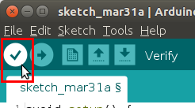

# robotnik_signal_leds_manager 


## Index

1. [Overview](#overview)
    1. [Bringup](#overview)
2.  [Installation](#installation)
3. [Hardware setup](#hardware-setup)
4. [Usage](#usage)
5. [Examples](#examples)
    1. [Led effects test](#examples)
    2. [Led effects on a robot](#examples)
6. [Operational modes](#operational-modes)
    1. [Exclusive signals](#operational-modes)
    2. [Multiple signals](#operational-modes)
7. [Signal and led configuration](#config)
    1. [Signal configuration](#signal-configuration)
        1. [Paint mode](#paint-mode)
        2. [Blink mode](#blink-mode)
        3. [Shift mode](#shift-mode)
    2. [Led configuration](#led-configuration)
    3. [Creating a new signal](#new-signal)
8. [State machine](#state-machine)
9. [Advanced features](#advanced-features)
10. [Firmware update](firmware-update)


<a name="overview"></a>

## 1. Overview

### 1.1 Bringup

Running the node that manages the leds
```
roslaunch robotnik_signal_leds_manager leds_manager.launch
```


<a name="installation"></a>

## 2. Installation


Clone the repository in the working directory

```
$ cd ~/catkin_ws/src/
$ git clone https://github.com/RobotnikAutomation/robotnik_signal_manager.git
```

Install Robotnik dependencies

```
git clone https://github.com/RobotnikAutomation/robotnik_msgs.git
git clone https://github.com/RobotnikAutomation/rcomponent.git
git clone https://github.com/RobotnikAutomation/robotnik_signal_msgs.git
```

Install rosserial dependency, this will allow communication between ROS and the ALS module

```
$ sudo apt-get update
$ sudo apt-get install ros-kinetic-rosserial-arduino
$ sudo apt-get install ros-kinetic-rosserial
```

Install the rest of dependencies

```
$ cd ~/catkin_ws/
$ rosdep update
$ rosdep install --from-paths src --ignore-src -r -y
```

Build the working directory and messages. Make sure to compile ```robotnik_signal_leds_manager```

```
$ cd ~/catkin_ws/
$ catkin_make
$ catkin_make --only-pkg-with-deps robotnik_signal_leds_manager
$ source ~/devel/setup.bash
```

Add udev rule from ALS module and reload and trigger the updated udev rules

```
$ sudo cp ~/catkin_ws/src/robotnik_signal_manager/robotnik_signal_leds_manager/robotnik_leds_utils/49-teensy-leds.rules /etc/udev/rules.d
$ sudo udevadm control --reload-rules && udevadm trigger
```

Connect the ALS module via USB. Verify that the port is shown under the ``` /dev/ttyLEDs ``` symlink

```
cd /dev && ls -l ttyLEDs
```
<a name="hardware-setup"></a>

## 3. Hardware setup

Below is a list of the hardware you will need to get started:

- Computer with Ubuntu 16.04 and ROS Kinetic
- Teensy 3.2 board
- RGBW led strip
- Wires


<a name="usage"></a>

## 4. Usage

1. Connect the ALS module to the USB port of the computer. All the leds should start to blink white, this means that the ALS module has started.

2. In a terminal, launch the driver without ``` exclusive_signals ```. All the LEDs will turn green when the driver has finished loading. This means that the driver is ready to accept commands.

```
$ roslaunch robotnik_signal_leds_manager leds_manager.launch exclusive_signals:=false
```

3. In another terminal, send a command to the ALS module. All LEDs will blink green at 1 Hz.

```
$ rosservice call /leds_driver_node/set_signal "id: 'EMERGENCY'               
enable: true"
```

To erase the effect on the strip, disable it.

```
$ rosservice call /leds_driver_node/set_signal "id: 'EMERGENCY'               
enable: false"
```

4. To close the driver, just do CTRL + C. All leds effects will be erased and all leds will light up blue. This means that the driver has ended. If the driver is launched again the LEDs will light up green waiting for a command.


<a name="examples"></a>

## 5. Examples

In the robotnik leds example folder you can find several examples ready to test. 

### 5.1 Example of led effects

Connect ALS module via USB to computer and launch the example

```
$ roslaunch robotnik_leds_example leds_test_example.launch
```

Different effects will appear on the led strip, then they will be gradually erased. This process continues in an infinite loop. If the program ends, the LEDs will light blue.

### 5.2 Example of leds on a robot

This example needs a real or simulated robot. The robot rb2 from the manufacturer Robotnik Automation will be used in Gazebo.Follow the next steps to install the robot https://github.com/RobotnikAutomation/rb2_sim

Launch the robot, in this case

```
$ roslaunch rb2_sim_bringup rb2_complete.launch
```

Launch the example. Specify the topic where the robot speed is published, in this case

```
$ roslaunch robotnik_leds_example leds_robot_example.launch cmd_vel:=/robot/robotnik_base_control/cmd_vel
```

In another terminal, control the robot

```
$ rosrun teleop_twist_keyboard teleop_twist_keyboard.py cmd_vel:=/robot/robotnik_base_control/cmd_vel
```

When you move the robot, the LEDs will blink green. If the robot stops, the LEDs will light up green

<a name="operational-modes"></a>

## 6. Operational modes

This driver is prepared to work in two modes. You can choose the mode through the ``` exclusive_signals ``` parameter 

### 6.1 Mode with exclusive signals

This mode allows to have only a single active effect on the LEDs. The signal that is running on the LEDs is replaced
by the next signal sent from the driver.There must always be an active signal.To use this mode set ``` exclusive_signals ``` to ``` true ```

```
$ roslaunch robotnik_signal_leds_manager leds_manager.launch exclusive_signals:=true
```

### 6.2 Mode with multiple signals

This mode allows the activation of multiple signals at the same time on the LEDs. To use this mode  set ``` exclusive_signals ``` to ``` false ```

```
$ roslaunch robotnik_signal_leds_manager leds_manager.launch exclusive_signals:=false
```

<a name="config"></a>

## 7. Signal and led configuration

This driver allows to create new signals to create new led effects. In ```robotnik_signal_leds_manager/config```  you can find two configuration files

<a name="signal-configuration"></a>

### 7.1 Signal configuration

```
robotnik_signal_leds_manager/config/signals.yaml
```

This file defines the behavior that a led zone will have. For example you can define that the leds will blink at a certain frequency. 
All these properties have an ```id``` assigned, which is known as a ```signal``` 
 ```
signals:

  - id: "EMERGENCY"
    enabled: false
    led_label: ["front_right_leds"]
    mode: "blink"
    color: [255, 0, 0, 0]
    ms_on: 1000
    ms_off: 1000
 ```

The example above defines that the led zone called ```front_right_leds``` will work in blinking mode at 1 Hz in red color.


The  ```signal.yaml``` file defines the behavior of the LEDs. Inside the list ```signals``` create the states with the desired behavior.

The common structure are those parameters used by all the led effects. It must have the following:

 ```
  signals:

  - state: " ... "
    enabled: ...
    led_label: [“ ... “]
    mode: " ... "
    color: [... , ... , ... ]
 ```

| Parameter       | Description       | Format  |  Input  |
|:-------------:|:-------------|:---------------:| -----------:|
| id      | Signal name. It can have any name as long as it is not in use in the list. This name is sent to the driver to know what configuration must be sent to the ALS module. | String | Signal name |
| enabled      | Default value when driver starts |  Bool | true or false |
| led_label      | Name of the label of the leds defined in the configuration file led_config.yaml. It contains the necessary information to know which LEDs should execute the signal. A signal can contain multiple led labels. | String array | Led labels defined in led_config.yaml |
| mode | Desired led effect. Currently there three types: paint, blink and shift.   |  String | Mode name: "paint", "blink" o "shift" |
| color | Color in which the LEDs light up. The white color is optional. |  [uint8_t, uint8_t, uint8_t, uint8_t] | Color in this order: red, green, blue and white |

The rest of the parameters depend on the mode used. Currently there are three modes: paint, blink and shift

<a name="paint-mode"></a>

### a) Paint mode

**Description:** illuminates a led area of ​​the specified color

| Parameter       | Description       | Format  |  Input  |
|:-------------:|:-------------|:---------------:| -----------:|
| ---      | This mode does not need additional parameters, with common parameters it is enough to define the effect. | --- | --- |
 
<a name="blink-mode"></a>

### b) Blink mode

**Description:** blinks a led area of ​​the specified color

| Parameter       | Description       | Format  |  Input  |
|:-------------:|:-------------|:---------------:| -----------:|
| ms_on      | Led on time. They will light up in the specified color | uint16_t | Time in miliseconds |
| ms_off     | Led off time. They will be off, without color  | uint16_t | Time in miliseconds |

<a name="shift-mode"></a>

### c) Shift mode

**Description:** within the specified led area, the leds light up one after the other until they are all on. After that, all the LEDs turn off and the sequence is repeated.


| Parameter       | Description       | Format  |  Input  |
|:-------------:|:-------------|:---------------:| -----------:|
| speed      | Time elapsed between the first led and the last led | uint_16 | Time in miliseconds |
| direction     | Direction in which the LEDs will light  | String | "right" or "left" |
| led_increment | Coming soon   |  --- | --- |
| sleep | This parameter is deprecated |  --- | --- |

**Limitations:** The vast majority of addressable leds take time to act. This causes shift effects to be slow when there are many LEDs. With the parameter led_increment you can modify the number of leds that light up in each increment. This allows the speed parameter to work within the indicated time.

<a name="effects-animations"></a>

### Effects animations

Paint effect:


Blink effect:


Shift effect:


<a name="led-configuration"></a>

### 7.2 Led configuration

```
robotnik_signal_leds_manager/config/leds_config.yaml
```


This file specifies the hardware used by the LEDs. For example, here it is specified what LED model is used and the LED zone to which 
it is applied. All these properties have an ```led_label``` assigned, which is used by the signals to define in what type of LEDs an effect is applied.

 ```
leds_config:
  
  - led_label: "front_right_leds"
    leds_zone: [1, 20]
    channel: 0
    type: "RGB"
 ```
 In the example above it is defined that LEDs 1 to 20 are connected to channel 0 of the ALS module and are of the RGB type. 


The ```led_config.yaml ``` file defines the hardware associated with the LEDs. Inside ```leds_config``` create the labels with the desired configuration.

Structure:
```
leds_config:

  - led_label: " ... "
    led_zone: [ ... , ... ]
    channel: ...
    type: "..."
```


| Parameter       | Description       | Format  |  Input  |
|:-------------:|:-------------|:---------------:| -----------:|
| led_label      | Configuration name for a group of leds. This name is used in the led_state.yaml file |String | Configuration name |
| led_zone     | Led working area. Indicates the LEDs involved in an effect.  |  [uint16, uint16_t] | Initial led, final led |
| channel | Channel to which the LEDs are connected in the ALS module   |  String | ALS module channel |
| type | Indicates the model of led used. ALS supports RGB and RGBW leds.|  String | Type name: "RGB" or "RGBD" |


<a name="new-signal"></a>

 ### 7.3 Creating a new signal

To define a new signal go to ```robotnik_signal_leds_manager/config``` and create a new folder or edit one. In this case use  ```robot ``` folder 

Open ```leds_config.yaml```.

```
robotnik_signal_leds_manager/config/robot/leds_config.yaml
```

Edit the file and add a new led configuration. In this example the hardware setup is a RGB led strip connected to channel 0 of the ALS module. This setting will be applied to leds from 14 to 23 and will be identified as  ```my_led_zone```

```
  - led_label: "my_led_zone"
    leds_zone: [14, 23]
    channel: 0
    type: "RGB"
 ```

Now open

```
robotnik_signal_leds_manager/config/robot/signals.yaml
```

Edit the file and add a new signal configuration. You can define the led effect that you want. In this case the shift mode has been chosen. This effect will work on the leds defined by the previously created ```my_led_zone``` label. The rest of the parameters determine the behavior of the effect.

```
  - id: "MY_TURN_LEFT"
    enabled: false
    led_label: ["my_led_zone"]
    mode: "shift"
    color: [0, 0, 0, 40]
    direction: "left"
    speed: 2000
    sleep: 0
```

Due to this driver is managed by a ```robotnik_signal_manager package``` any signal added here must also be defined on that package.

So, open:

```
robotnik_signal_interface/config_example/robot/signals.yaml
```

And add the new sign you just created:

```
  - id: "MY_TURN_LEFT"
    enabled: false
```

Now you can launch the package in multiple signals mode

```
$ roslaunch robotnik_signal_leds_manager leds_manager.launch exclusive_signals:=false
```

In other terminal, send the signal to ALS module, you will see the leds in shift mode

```
$ rosservice call /leds_driver_node/set_signal "id: 'MY_TURN_LEFT'               
enable: true"
```

<a name="state-machine"></a>

## 8. State machine

The ALS device is capable of displaying its status through the LEDs although the ROS driver is not
is running. For this, a state machine has been implemented:


| States        | Description           | Default effect  |
| ------------- |:-------------| :------------------------|
| Booting | The ALS device has finished booting and is waiting for the driver to start in ROS | All LEDs blink on white. |
| Ready | The driver has started. The ALS device wait to receive the first command. | All leds light up in green |
| Running | The first command has been sent to the ALS module. Thereafter, the received commands will be executed on the LEDs. |  The leds light up according to the command received |
| Fault/Exit | Driver has terminated intentionally or unexpectedly. It holds in this state until the driver restarts. | All leds light up blue |

<a name="advanced-features"></a>

## 9.Advanced features


<a name="firmware-update"></a>

## 10. Firmware update

Install version 1.8.12 of the Arduino IDE [here](https://www.arduino.cc/en/main/software)

Install Teensy Loader here [here](https://www.pjrc.com/teensy/td_download.html)

Open Arduino IDE and set Teensy:


Click on verify button



Teensy loader will open


Open the .hex file found in:

```
robotnik_leds_utils/ALS_Firmware_v0.0.hex
```

Press the physical reset button on the Teensy board. The firmware will upload automatically

