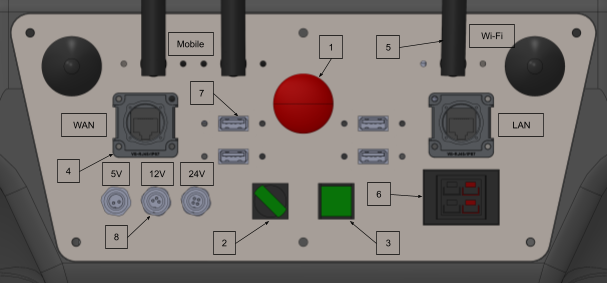

Getting Started
===============

.. autosummary::
    :toctree: generated

To get started with the robot you need to make sure that you have the following dependencies installed on your pc:

- ROS Melodic 
- Ubuntu 18.04

.. note::

    You may prefer to use docker to containerize the development environment. If you are interested in using docker, please refer to the :doc:`docker` section.

Robot startup
-------------
To start up the robot, please refer to this image:

    :alt: Rear IO panel

.. code-block:: yaml

    aau_robotics_lab:
    global_frame: robot_map
    maps_package: robot_bringup
    maps:
        localization: maps/aau_robotics_lab/aau_robotics_lab.yaml
        routes: maps/aau_robotics_lab/aau_robotics_lab.yaml
