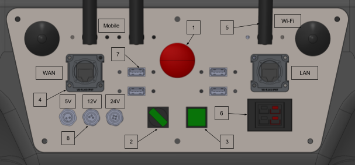

Getting Started
===============

.. autosummary::
    :toctree: generated

To get started with the robot you need to make sure that you have the following dependencies installed on your pc:

- ROS Melodic 
- Ubuntu 18.04

.. note::

    You may prefer to use Docker to containerize the development environment. If you are interested in using Docker, please refer to the :doc:`docker` section.

Robot startup
-------------
To start up the robot, please refer to this image:

1. Rotate the power switch (2) to the ON position.
2. The CPU button (3) will turn green when the onboard computer is powered on.
3. Connect a monitor, keyboard and mouse to the onboard computer using the HDMI and USB ports (7).
4. The robot will boot up and the robot's computer will automatically start ROS and the robot's packages. For this automatic startup sequence please refer to the :doc:`automatic_ros_startup` section.
5. Once the robot is booted up, you can see the robot's manual on the desktop. Please read this manual carefully before proceeding.

6. Connect to the robot's wifi network. The robot's wifi network is called ``shl00-210420ab`` and the password is ``R0b0tn1K``.
7. Add the hostname and IP of your PC to the robot's ``/etc/hosts`` file. This is necessary for the robot to be able to communicate with your PC. You can do this using vim or nano:  

.. code-block:: bash

    sudo vim /etc/hosts

or

.. code-block:: bash

    sudo nano /etc/hosts

When inside the file, add the following line to the end of the second section of the file:

``<your_ip> <your_pc_hostname>``

This is important such that the robot can resolve your hostname to your IP address. You can find your IP address by running the following command:

.. code-block:: bash

    hostname -I

Host Setup 
----------

Add the robot's hostname and IP to your PC's ``/etc/hosts`` file. The robots hostname and IP is as stated in the manual:

.. code-block:: text

    192.168.0.200 shl00-210420ab

.. ``192.168.0.200 shl00-210420ab``

.. .. code-block:: yaml

..     aau_robotics_lab:
..     global_frame: robot_map
..     maps_package: robot_bringup
..     maps:
..         localization: maps/aau_robotics_lab/aau_robotics_lab.yaml
..         routes: maps/aau_robotics_lab/aau_robotics_lab.yaml
